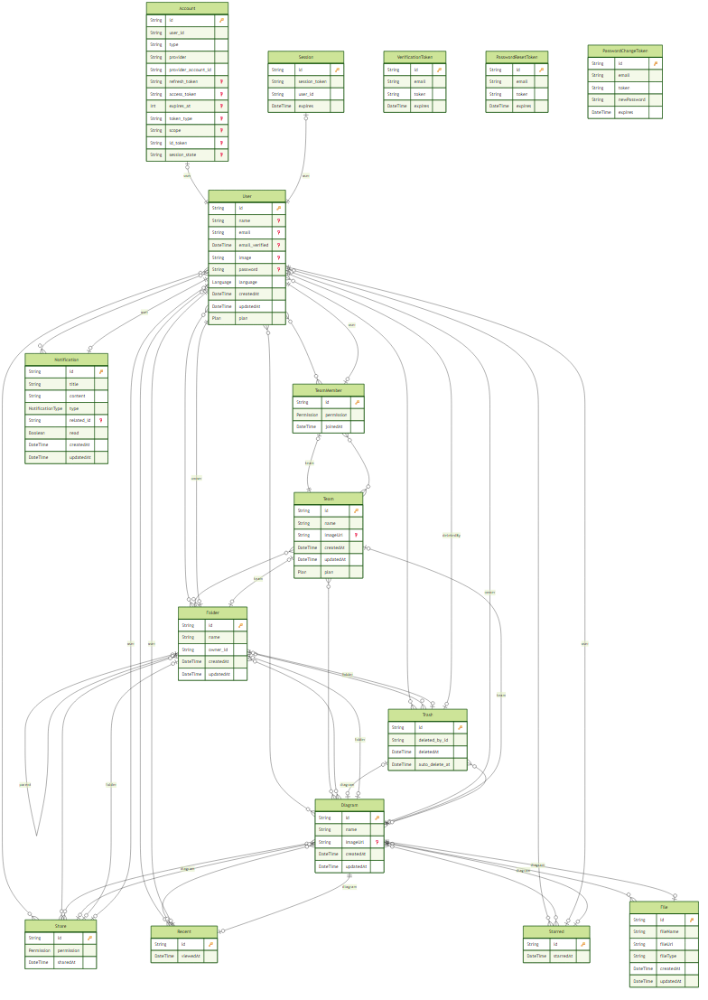

# Knowledge Visualization System

An AI-powered platform for transforming documents and notes into interactive knowledge graphs with real-time collaboration capabilities.



## 🎯 Project Overview

Knowledge Visualization System (Knovion) is a modern web application that leverages artificial intelligence to help users visualize, organize, and explore complex information through interactive knowledge graphs. The system automatically extracts key concepts, relationships, and structures from documents and presents them in an intuitive, collaborative environment.

### Key Results & Impact

- **Automated Knowledge Extraction**: AI-powered document analysis using Google's Gemini models
- **Real-time Collaboration**: Multiple users can co-create and edit knowledge maps simultaneously
- **Intelligent Document Processing**: Supports PDF and text file uploads with automatic vectorization
- **Smart Search & Retrieval**: Vector-based semantic search for relevant information discovery
- **Multi-view Visualization**: Interactive graph views with zoom, pan, and multiple perspectives
- **Team Management**: Comprehensive permission system (Owner, Editor, Viewer) for teams and resources

## 🏗️ Architecture & Scale

### System Architecture

The system follows a **microservices architecture** with clear separation of concerns:

```
┌─────────────────────┐
│   Frontend (Next.js) │
│   Port: 3000         │
└──────────┬───────────┘
           │
           │ REST API / WebSocket
           │
┌──────────▼───────────┐      ┌─────────────────────┐
│   Backend (FastAPI)   │◄────►│  Liveblocks         │
│   Port: 8000          │      │  (Real-time sync)   │
└──────────┬───────────┘      └─────────────────────┘
           │
           │
┌──────────▼───────────┐      ┌─────────────────────┐
│  PostgreSQL          │      │  pgvector            │
│  (Main Database)     │      │  (Vector Store)      │
└──────────────────────┘      └─────────────────────┘
           │
           │
┌──────────▼───────────┐
│  AWS S3              │
│  (File Storage)      │
└──────────────────────┘
```

### Scale & Capacity

- **Database**: PostgreSQL 16 with pgvector extension for vector similarity search
- **Concurrent Users**: Supports real-time collaboration via Liveblocks
- **File Processing**: Asynchronous document processing using FastAPI and LangChain
- **Storage**: AWS S3 for scalable file storage
- **Deployment**: Docker containerized services for easy scaling

## 💻 Technology Stack

### Frontend Technologies

| Technology | Version | Purpose |
|------------|---------|---------|
| **Next.js** | 16.0.7 | React framework with App Router and Server Components |
| **React** | 19.2.1 | UI library |
| **TypeScript** | 5.x | Type-safe development |
| **TailwindCSS** | 4.1.17 | Utility-first CSS framework |
| **@xyflow/react** | 12.10.0 | Interactive node-based graph visualization |
| **Liveblocks** | 3.11.0 | Real-time collaboration infrastructure |
| **Prisma** | 7.0.1 | Type-safe database ORM |
| **NextAuth.js** | 5.0.0 | Authentication solution |
| **Zustand** | 5.0.8 | Lightweight state management |
| **TanStack Query** | 5.90.11 | Server state management |
| **React Hook Form** | 7.65.0 | Form validation and management |
| **Zod** | 4.1.12 | Schema validation |
| **Framer Motion** | 12.23.24 | Animation library |
| **Radix UI** | Multiple | Accessible component primitives |

### Backend Technologies

| Technology | Version | Purpose |
|------------|---------|---------|
| **FastAPI** | 0.115+ | High-performance async Python web framework |
| **Python** | 3.13 | Programming language |
| **LangChain** | 0.3+ | LLM application framework |
| **LangGraph** | 0.2+ | Stateful workflow orchestration for LLMs |
| **Google Gemini** | API | AI model for text generation and analysis |
| **pgvector** | pg16 | Vector similarity search in PostgreSQL |
| **SQLAlchemy** | 2.0+ | SQL toolkit and ORM |
| **Psycopg** | 3.0+ | PostgreSQL adapter with binary and pool support |
| **PyPDF** | Latest | PDF processing library |
| **Boto3** | Latest | AWS SDK for Python |
| **httpx** | Latest | Async HTTP client |
| **python-dotenv** | Latest | Environment variable management |
| **unstructured** | Latest | Text extraction from various formats |

### Database & Infrastructure

- **PostgreSQL 16** with pgvector extension
- **Docker & Docker Compose** for containerization
- **AWS S3** for file storage
- **Liveblocks** for real-time synchronization

### AI/ML Components

- **Google Gemini API**: Large language model for:
  - Document summarization
  - Question answering
  - Mindmap generation
  - Query rewriting
  - Document grading
- **Vector Embeddings**: Semantic search using pgvector
- **RAG (Retrieval-Augmented Generation)**: Context-aware AI responses
- **LangGraph Workflows**: Stateful AI agent orchestration

## 🎭 User Roles & Permissions

The system implements a comprehensive role-based access control (RBAC):

### User Types

1. **Individual Users**
   - Personal workspace
   - Free, Plus, and Pro plans
   - Private folders and diagrams

2. **Team Members**
   - Collaborative workspace
   - Shared resources
   - Team-level permissions

### Permission Levels

| Permission | Capabilities |
|------------|--------------|
| **OWNER** | Full control - create, edit, delete, share |
| **EDITOR** | Edit content, cannot delete or manage permissions |
| **VIEWER** | Read-only access |

## 🌟 Key Features

### 1. AI-Powered Document Processing

- **Automatic Extraction**: Upload PDFs or text files and let AI extract key concepts
- **Semantic Understanding**: Uses vector embeddings for deep semantic analysis
- **Intelligent Summarization**: Generates concise summaries of lengthy documents
- **Context-Aware Responses**: RAG-based chatbot with document-specific knowledge

### 2. Interactive Visualization

- **Knowledge Graphs**: Interactive node-based visualization using XYFlow
- **Multiple Views**: Graph, hierarchical, and timeline perspectives
- **Smooth Interactions**: Zoom, pan, drag-and-drop functionality
- **Customizable Layouts**: Automatic and manual node positioning

### 3. Real-Time Collaboration

- **Live Cursors**: See other users' cursors in real-time
- **Simultaneous Editing**: Multiple users can edit the same diagram
- **Instant Sync**: Changes propagate immediately to all collaborators
- **Presence Indicators**: Know who's currently viewing/editing

### 4. Smart Organization

- **Folder Hierarchy**: Organize diagrams in nested folders
- **Team Workspaces**: Separate personal and team content
- **Starred Items**: Quick access to important diagrams
- **Recent Activity**: Track recently viewed diagrams
- **Trash Management**: 30-day automatic deletion for trashed items

### 5. Advanced Search

- **Semantic Search**: Vector-based similarity search
- **Full-Text Search**: Quick keyword-based finding
- **Filtered Search**: Search within specific folders or teams

### 6. Notification System

- **Activity Notifications**: Sharing, invitations, updates
- **Real-time Alerts**: Instant notification delivery
- **Notification Types**:
  - Diagram shared
  - Folder shared
  - Team shared
  - User invited

## 📊 Database Schema

The system uses a sophisticated relational database with 15+ interconnected tables:

- **User Management**: Account, Session, User, VerificationToken, PasswordResetToken
- **Collaboration**: Team, TeamMember, Share
- **Content Organization**: Folder, Diagram, File
- **Activity Tracking**: Recent, Starred, Trash
- **Communication**: Notification

See the [Entity Relationship Diagram](./frontend/ERD.png) for detailed relationships.

## 🚀 Getting Started

### Prerequisites

- **Node.js** 20.x or later
- **Python** 3.13
- **Docker** 20.10 or later
- **Docker Compose** 2.0 or later
- **PostgreSQL** 16 (or use Docker)

### Environment Setup

1. **Clone the repository**
   ```bash
   git clone https://github.com/trinhdamhuy/knowledge-visualization-system.git
   cd knowledge-visualization-system
   ```

2. **Setup Backend**
   ```bash
   cd backend
   cp .env.example .env
   # Edit .env with your credentials
   docker-compose up --build
   ```

   Required environment variables:
   - `POSTGRES_USER`, `POSTGRES_PASSWORD`, `POSTGRES_HOST`, `POSTGRES_PORT`, `POSTGRES_DB`
   - `GOOGLE_API_KEY` (for Gemini AI)
   - `LIVEBLOCKS_SECRET_KEY` (for real-time sync)
   - `FRONTEND_URL`

3. **Setup Frontend**
   ```bash
   cd frontend
   cp .env.example .env
   # Edit .env with your credentials
   npm install
   npx prisma generate
   npx prisma db push
   npm run dev
   ```

   Required environment variables:
   - `DATABASE_URL` (PostgreSQL connection string)
   - `BACKEND_URL` (FastAPI URL, default: http://localhost:8000)
   - `AUTH_SECRET`, `AUTH_GOOGLE_ID`, `AUTH_GOOGLE_SECRET`
   - `AWS_BUCKET`, `AWS_REGION`, `AWS_ACCESS_KEY_ID`, `AWS_ACCESS_SECRET`
   - `LIVEBLOCKS_SECRET_KEY`

### Access the Application

- **Frontend**: http://localhost:3000
- **Backend API**: http://localhost:8000
- **API Documentation**: http://localhost:8000/docs

## 🔧 Development

### Frontend Development

```bash
cd frontend
npm run dev          # Start development server
npm run build        # Build for production
npm run start        # Start production server
npm run lint         # Run ESLint
```

### Backend Development

```bash
cd backend
docker-compose up             # Start with Docker
docker-compose logs -f        # View logs
docker-compose down           # Stop services
docker-compose down -v        # Stop and remove volumes
```

### Database Management

```bash
cd frontend
npx prisma studio              # Open Prisma Studio
npx prisma generate            # Generate Prisma Client
npx prisma db push             # Push schema changes
npx prisma migrate dev         # Create migrations
```

## 🤖 AI Workflow

The system implements a sophisticated LangGraph-based workflow:

### Chat Mode (RAG)
```
START → retrieve_documents → grade_documents → [rewrite_question?] → generate_answer → END
```

### Generate Mode (Document Processing)
```
START → load_file → add_documents → summarize_documents → generate_mindmap_data → END
```

### Key AI Features

1. **Document Grading**: Evaluates relevance of retrieved documents
2. **Query Rewriting**: Improves search queries for better results
3. **Vector Storage**: Stores document embeddings for semantic search
4. **Context Management**: Maintains conversation history and context
5. **Streaming Responses**: Real-time AI response streaming via Liveblocks

## 📈 Performance & Optimization

- **Server Components**: Reduced client-side JavaScript with Next.js App Router
- **Async Processing**: Non-blocking document processing with FastAPI
- **Vector Indexing**: Fast semantic search with pgvector
- **CDN Integration**: Static assets served via Vercel Edge Network
- **Database Connection Pooling**: Efficient PostgreSQL connections
- **Caching**: Prisma Accelerate for query caching

## 🔒 Security

- **Authentication**: Secure session-based auth with NextAuth.js
- **Password Hashing**: Bcrypt encryption for user passwords
- **CORS Protection**: Configured CORS middleware
- **SQL Injection Prevention**: Prisma ORM with parameterized queries
- **Token Management**: Secure token generation and validation
- **Environment Variables**: Sensitive data stored in .env files

## 🌍 Internationalization

- **Multi-language Support**: next-intl integration
- **Supported Languages**: English (en), Japanese (ja)
- **User Preferences**: Language settings stored per user

## 📦 Deployment

### Docker Deployment (Recommended)

The backend is containerized and ready for deployment:

```bash
cd backend
docker-compose up -d --build
```

### Frontend Deployment

Optimized for deployment on Vercel:

1. Connect your GitHub repository to Vercel
2. Configure environment variables
3. Deploy automatically on push to main branch

### Database Deployment

- Use managed PostgreSQL service (AWS RDS, Neon, Supabase)
- Ensure pgvector extension is installed
- Configure connection pooling

## 🤝 Contributing

1. Fork the repository
2. Create a feature branch (`git checkout -b feature/amazing-feature`)
3. Commit your changes (`git commit -m 'Add amazing feature'`)
4. Push to the branch (`git push origin feature/amazing-feature`)
5. Open a Pull Request

## 📄 License

This project is private. All rights reserved.

## 👥 Team & Support

- **Repository Owner**: [@trinhdamhuy](https://github.com/trinhdamhuy)
- **Issues**: [GitHub Issues](https://github.com/trinhdamhuy/knowledge-visualization-system/issues)

## 🎓 Use Cases

### Education
- Visualize course content and relationships
- Create study guides from textbooks
- Collaborative note-taking for study groups

### Research
- Map research papers and citations
- Organize literature reviews
- Track concept relationships across documents

### Business
- Knowledge base management
- Project documentation
- Team collaboration on complex topics

### Personal Knowledge Management
- Digital garden creation
- Personal wiki building
- Learning path visualization

## 🔮 Future Roadmap

- [ ] Export to various formats (PNG, SVG, JSON)
- [ ] Advanced AI model selection (Claude, GPT-4)
- [ ] Mobile application
- [ ] Offline mode support
- [ ] Version control for diagrams
- [ ] API webhooks for integrations
- [ ] Advanced analytics and insights
- [ ] Custom AI model fine-tuning

---

**Built with ❤️ using Next.js, FastAPI, and AI**
